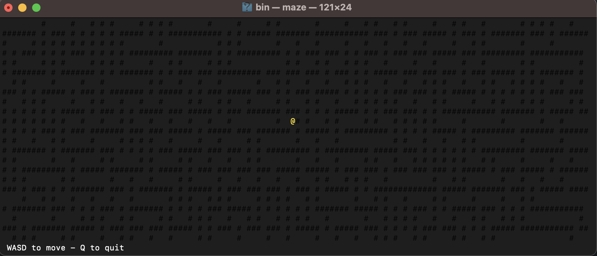

<div style="display: flex; align-items: center; flex-direction: column;" align="center">
    
    <h1 style="text-align: center;">CmdFX</h1>
    <p style="text-align: center;">A lightweight game engine for your terminal.</p>
    <div align="center">
        
        
        
        
        
    </div>
</div>

---



---

**cmdfx** is a lightweight game engine for your terminal, allowing you to create some pretty wild things. It is designed to be simple and easy to use, while still providing a powerful set of features.

It is written in C and is available cross-platform. It is licensed under the MIT license.

## 🍎 Features

- **Cross-platform**: cmdfx is available on Windows, macOS, and Linux.
- **Curses-backed**: renders through (n)curses (PDCurses on Windows) for portable terminal output.
- **Lightweight**: cmdfx is designed to be lightweight and fast.
- **Easy to use**: cmdfx is simple to use and easy to learn.
- **Powerful**: cmdfx provides a powerful set of features for creating terminal-based games.

### 📋 Highlighted Features

For a full method list, check out the [documentation](https://gmitch215.github.io/cmdfx/).

- **Events API**
  - Handle window events such as key presses and window resizing.
  - Register listeners for key, mouse, and button events.
- **Canvas API**
  - Draw characters and shapes on the terminal.
  - Set foreground and background colors.
  - Clear the screen.
  - Get the size of the terminal and the screen.
  - ...and much more!
  - **Sprites API**
    - Load and draw sprites on the terminal.
    - Set the color of a sprite.
    - Create Gradients for a sprite.
    - ...and much more!
- **Builder API**
  - Easily build 2D arrays of characters and strings.
  - Set the color of the text.
  - Create gradients of text and colors!
  - ...and much more!
- **Physics Engine**
  - Create and manage physics objects with the Sprite API.
  - Set the velocity and acceleration of a sprite.
  - Detect collisions between sprites.
  - ...and much more!
- **Input API**
  - Receive keyboard and mouse input through the event system.
  - React to key presses, mouse clicks, and terminal resizes.
  - ..and much more!
- **Cross-Platform Exposure**
  - Expose platform-specific features and utilities such as setting the title of the terminal.

## 📦 Installation

You can download the latest release of cmdfx from the [releases page](https://github.com/gmitch215/cmdfx/releases).

### Install via Script

Use the cross-platform Bash installer to clone, build, and install cmdfx with CMake.

#### Prerequisites

cmdfx renders through a curses library, so a curses development package is required:

- **Linux**: `sudo apt-get install -y libncursesw5-dev` (or `libncurses-dev`)
- **macOS**: ncurses ships with the system (`brew install ncurses` is optional)
- **Windows (MSYS2/MinGW)**: `pacman -S mingw-w64-x86_64-ncurses`, or install PDCurses. If no curses is found at configure time, the build fetches PDCurses automatically.

Linux additionally requires the ALSA sound library for audio:

```
sudo apt-get update
sudo apt-get install -y libasound2-dev libncursesw5-dev
```

If ALSA is not installed, sound support will not be built.

#### Running the Installer

```sh
# default install (includes kotlin/native, tests, docs, full clone)
curl -fsSL https://raw.githubusercontent.com/gmitch215/cmdfx/master/install.sh | bash

# disable kotlin/native and enable shallow (most common use case with c/c++)
curl -fsSL https://raw.githubusercontent.com/gmitch215/cmdfx/master/install.sh | bash -s -- --no-kn --shallow

# include debug statements
curl -fsSL https://raw.githubusercontent.com/gmitch215/cmdfx/master/install.sh | bash -s -- --type Debug

# to disable building tests
curl -fsSL https://raw.githubusercontent.com/gmitch215/cmdfx/master/install.sh | bash -s -- --no-tests

# to disable including documentation
curl -fsSL https://raw.githubusercontent.com/gmitch215/cmdfx/master/install.sh | bash -s -- --no-docs
```

- macOS/Linux (bash/zsh):

```sh
curl -fsSL https://raw.githubusercontent.com/gmitch215/cmdfx/master/install.sh -o install-cmdfx.sh
bash install-cmdfx.sh
```

- Windows: run from Git Bash (bundled with Git for Windows) or MSYS2 shell:

```sh
curl -fsSL https://raw.githubusercontent.com/gmitch215/cmdfx/master/install.sh -o install-cmdfx.sh
bash install-cmdfx.sh
```

Defaults after a no-flags run:

- MacOS: installs to `/usr/local`
- Linux: installs to `/usr`
- Windows (Git Bash/MSYS): installs to `C:/Program Files/cmdfx`

Common options:

- `--branch <name>`: install a tag/branch (e.g. `v0.3.3`)

```sh
curl -fsSL https://raw.githubusercontent.com/gmitch215/cmdfx/master/install.sh | bash -s -- --branch v0.3.3
```

- `--prefix <path>`: change install prefix

```sh
curl -fsSL https://raw.githubusercontent.com/gmitch215/cmdfx/master/install.sh | bash -s -- --prefix /custom/path
```

- `--type <Release|Debug>`: CMake build type

```sh
curl -fsSL https://raw.githubusercontent.com/gmitch215/cmdfx/master/install.sh | bash -s -- --type Release
```

- `--shallow`: faster shallow clone

```sh
curl -fsSL https://raw.githubusercontent.com/gmitch215/cmdfx/master/install.sh | bash -s -- --shallow
```

- `--no-tests`, `--no-docs`, `--no-package`, `--no-kn`: toggle optional components

```sh
curl -fsSL https://raw.githubusercontent.com/gmitch215/cmdfx/master/install.sh | bash -s -- --no-tests --no-docs
```

Run `./install.sh --help` for full options.

### Install via Homebrew

A `homebrew/core` submission is in progress. Until it lands, install from this
repository's tap:

```sh
brew tap gmitch215/cmdfx https://github.com/gmitch215/cmdfx
brew install gmitch215/cmdfx/cmdfx
```

This builds cmdfx from source and pulls in `ncurses` (and `alsa-lib` on Linux).
To build the latest `master` instead of the most recent release, append
`--HEAD` to the install command.

### Use in CMake Projects

cmdfx installs a CMake package with the target `cmdfx::cmdfx`.

```cmake
find_package(cmdfx REQUIRED)
add_executable(app main.c)
target_link_libraries(app PRIVATE cmdfx::cmdfx)
```

If CMake cannot find the package, point it at the install prefix:

```sh
cmake -S . -B build -DCMAKE_PREFIX_PATH="/usr/local"   # macOS
cmake -S . -B build -DCMAKE_PREFIX_PATH="/usr"         # Linux
cmake -S . -B build -DCMAKE_PREFIX_PATH="C:/Program Files/cmdfx"  # Windows
```

### GitHub Actions

Install cmdfx via the script, then build your project with CMake using the exported package.

```yml
name: Build with cmdfx

on: [push, pull_request]

jobs:
  build:
  runs-on: ${{ matrix.os }}
    strategy:
      matrix:
        include:
          - os: ubuntu-latest
            cmake_prefix: /usr
          - os: macos-latest
            cmake_prefix: /usr/local
          - os: windows-latest
            cmake_prefix: 'C:/Program Files/cmdfx'
    steps:
      - uses: actions/checkout@v6
      - name: Install Linux Dependencies
        if: startsWith(matrix.os, 'ubuntu')
        shell: bash
        run: |
          sudo apt-get update
          sudo apt-get install -y libasound2-dev
      - name: Install cmdfx
        shell: bash
        run: |
          curl -fsSL https://raw.githubusercontent.com/gmitch215/cmdfx/master/install.sh | bash
      - name: Configure
        shell: bash
        run: |
          cmake -S . -B build -DCMAKE_BUILD_TYPE=Release -DCMAKE_PREFIX_PATH="${{ matrix.cmake_prefix }}"
      - name: Build
        shell: bash
        run: cmake --build build
```

### Kotlin/Native

If you are using Kotlin/Native, you can add cmdfx as a dependency in your `build.gradle.kts` file:

```kotlin
plugins {
    kotlin("multiplatform") version "<version>"
}

repositories {
    // GitHub Packages requires authentication, even to read.
    // Provide a personal access token with the `read:packages` scope.
    maven("https://maven.pkg.github.com/gmitch215/cmdfx") {
        credentials {
            username = providers.gradleProperty("gpr.user").orNull ?: System.getenv("GITHUB_ACTOR")
            password = providers.gradleProperty("gpr.key").orNull ?: System.getenv("GITHUB_TOKEN")
        }
    }
}

kotlin {
    // Define your targets here
    macosArm64()
    mingwX64()

    sourceSets {
        // for example, if you are using macOS arm64
        macosArm64Main.dependencies {
            implementation("dev.gmitch215.cmdfx:cmdfx-macosarm64:<version>@klib")
        }

        // or, if you are using windows
        mingwX64Main.dependencies {
            implementation("dev.gmitch215.cmdfx:cmdfx-mingwx64:<version>@klib")
        }
    }
}
```

## 🚀 Examples

```c
#include <cmdfx.h>

int main() {
    // Set character at position (4, 4) to 'X'
    Canvas_setChar(4, 4, 'X');

    // Draw Circle with '#' at position (10, 10) with radius 5
    Canvas_fillCircle(10, 10, 5, '#');

    // Set Foreground to Red, then draw a line from (0, 0) to (10, 0)
    Canvas_setForeground(0xFF0000);
    Canvas_hLine(0, 0, 10);
}

```

```c
#include <cmdfx.h>

int main() {
    // (path, z-index)
    CmdFX_Sprite* mySprite = Sprite_loadFromFile("sprite.txt", 0);
    Sprite_setForegroundAll(mySprite, 0xFF0000); // Set Color to Red

    // Draw Sprite at position (5, 5)
    Sprite_draw(5, 5, mySprite);

    // Move Sprite to position (10, 10)
    Sprite_moveTo(mySprite, 10, 10);

    // (width, height, char, ansi, z-index)
    CmdFX_Sprite* background = Sprite_createFilled(10, 10, '#', 0, 0);

    // Set Gradient to Foreground with Red, Green, and Gold
    Sprite_setForegroundGradientAll(background, GRADIENT_ANGLE_45, 0xFF0000, 0x00FF00, 0xFFD700);
}

```

```c
#include <stdio.h>
#include <cmdfx.h>

// Detect when the terminal window is resized
int onResize(CmdFX_Event* event) {
    // Get payload data
    CmdFX_ResizeEvent* resizeEvent = (CmdFX_ResizeEvent*) event->data;

    // Print the previous and new size of the terminal
    printf("Terminal resized from %dx%d to %dx%d\n", resizeEvent->prevWidth, resizeEvent->prevHeight, resizeEvent->newWidth, resizeEvent->newHeight);

    return 0;
}

int main() {
    int r = 0;

    Canvas_clearScreen();
    addCmdFXEventListener(CMDFX_EVENT_RESIZE, onResize);

    while (1) {
        // Do nothing while we wait for an event
    }
}
```

More examples can be found in the [samples directory](/samples).

## 🧪 Sanitizers

For development, cmdfx can be built and tested under sanitizers. Pass
`-DSANITIZE_CMDFX=<list>` to CMake (e.g. `address,undefined` or `thread`), or use
the helper scripts which configure, build, and run the test suite for you:

```bash
./asan.sh    # AddressSanitizer + UndefinedBehaviorSanitizer
./ubsan.sh   # UndefinedBehaviorSanitizer only
./tsan.sh    # ThreadSanitizer (physics engine lifecycle / race detection)
```

ThreadSanitizer cannot be combined with AddressSanitizer, so it uses a separate
build directory. These require a Clang or GCC toolchain.

## 📝 Contributing

If you would like to contribute to cmdfx, please see the [contributing guidelines](CONTRIBUTING.md). All contributions are welcome!
